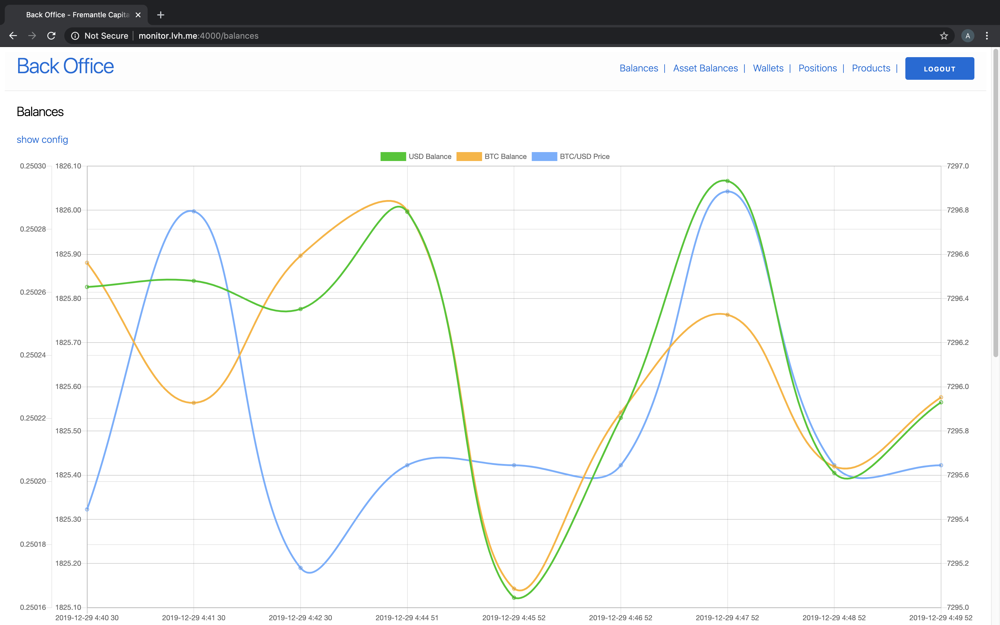
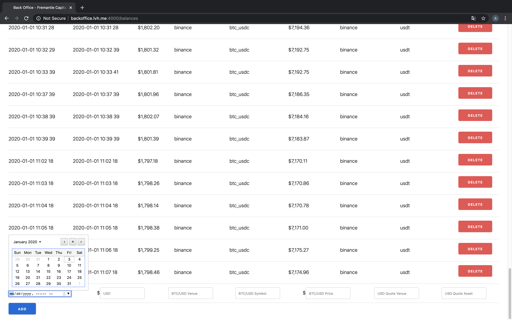
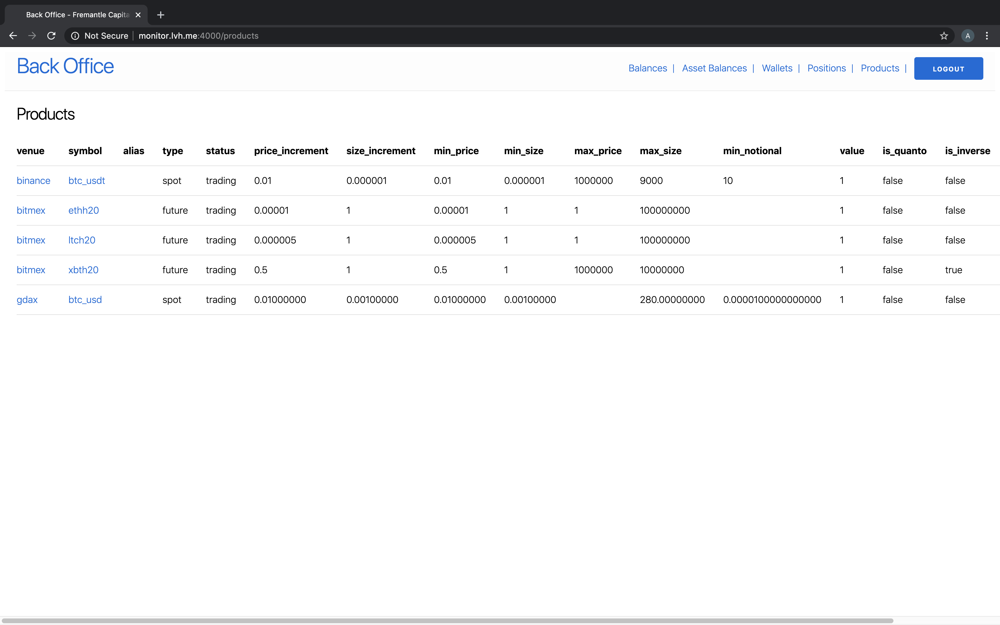

# Workbench
[](https://github.com/fremantle-industries/workbench/actions?query=workflow%3Atest)

Web app starter kit to manage operations of a fund.






## Requirements

- [Erlang OTP](https://www.erlang.org/)
- [Elixir](https://elixir-lang.org/)
- [Phoenix](https://www.phoenixframework.org/)
- [Tai](https://github.com/fremantle-industries/tai)
- [Postgres](https://www.postgresql.org/)
- [Google OAuth 2.0](https://developers.google.com/identity/protocols/OAuth2)

## Install

Clone the repository and install dependencies

```
$ git clone https://github.com/fremantle-industries/workbench.git /tmp/workbench && cd /tmp/workbench
$ mix deps.get
```

## Test

```bash
$ MIX_ENV=test mix ecto.create
$ MIX_ENV=test mix ecto.migrate
$ mix test
```

## Development

```bash
$ mix ecto.create
$ mix ecto.migrate
$ mix phx.server
```

## Production

```bash
$ DATABASE_URL=ecto://user@localhost/workbench_prod \
SECRET_KEY_BASE=$(mix phx.gen.secret) \
LIVE_VIEW_SIGNING_SALT=$(mix phx.gen.secret 32) \
GUARDIAN_SECRET_KEY=$(mix guardian.gen.secret) \
MIX_ENV=prod \
mix ecto.create

$ DATABASE_URL=ecto://user@localhost/workbench_prod \
SECRET_KEY_BASE=$(mix phx.gen.secret) \
LIVE_VIEW_SIGNING_SALT=$(mix phx.gen.secret 32) \
GUARDIAN_SECRET_KEY=$(mix guardian.gen.secret) \
MIX_ENV=prod \
mix ecto.migrate

$ DATABASE_URL=ecto://user@localhost/workbench_prod \
SECRET_KEY_BASE=$(mix phx.gen.secret) \
LIVE_VIEW_SIGNING_SALT=$(mix phx.gen.secret 32) \
GUARDIAN_SECRET_KEY=$(mix guardian.gen.secret) \
MIX_ENV=prod \
mix phx.server
```

## Help Wanted :)

If you think this `workbench` thing might be worthwhile and you don't see a feature 
we would love your contributions to add them! Feel free to drop us an email or open 
a Github issue.

## Authors

* [Alex Kwiatkowski](https://github.com/rupurt) - alex+git@fremantle.io

## License

`workbench` is released under the [MIT license](./LICENSE.md)
