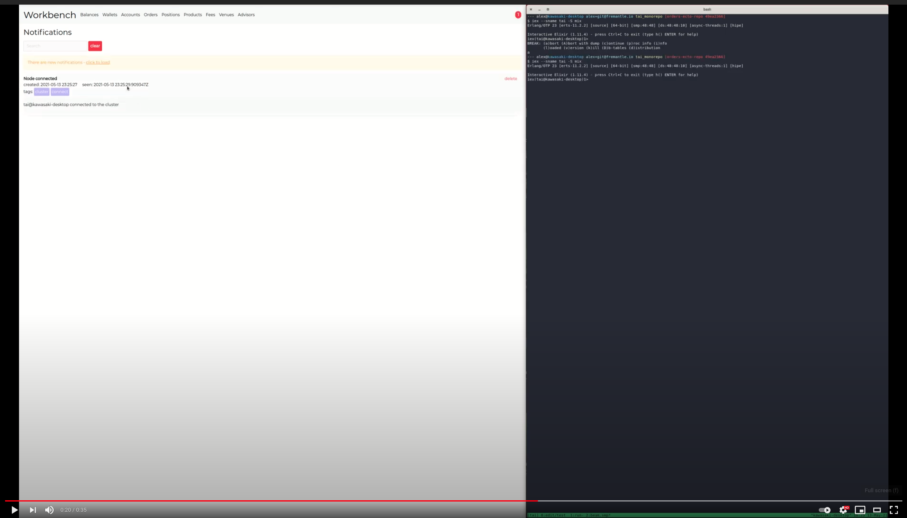
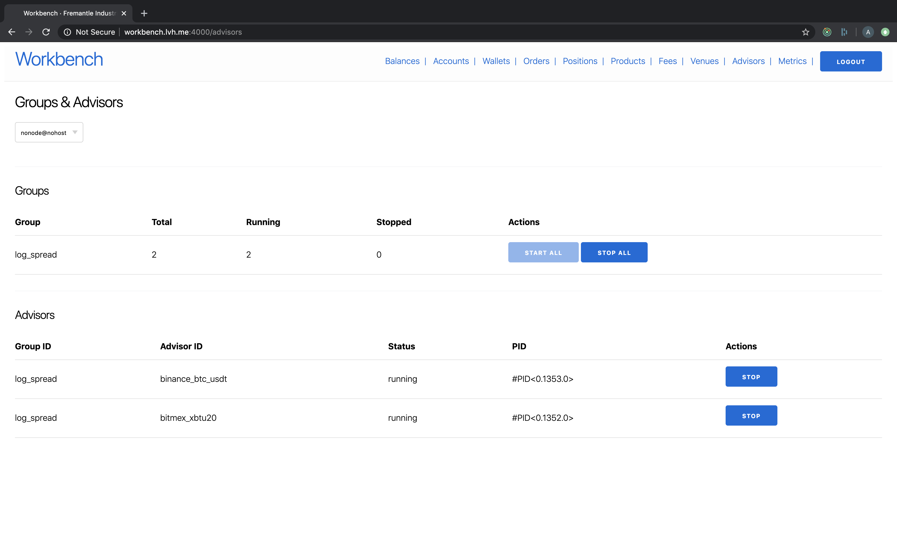
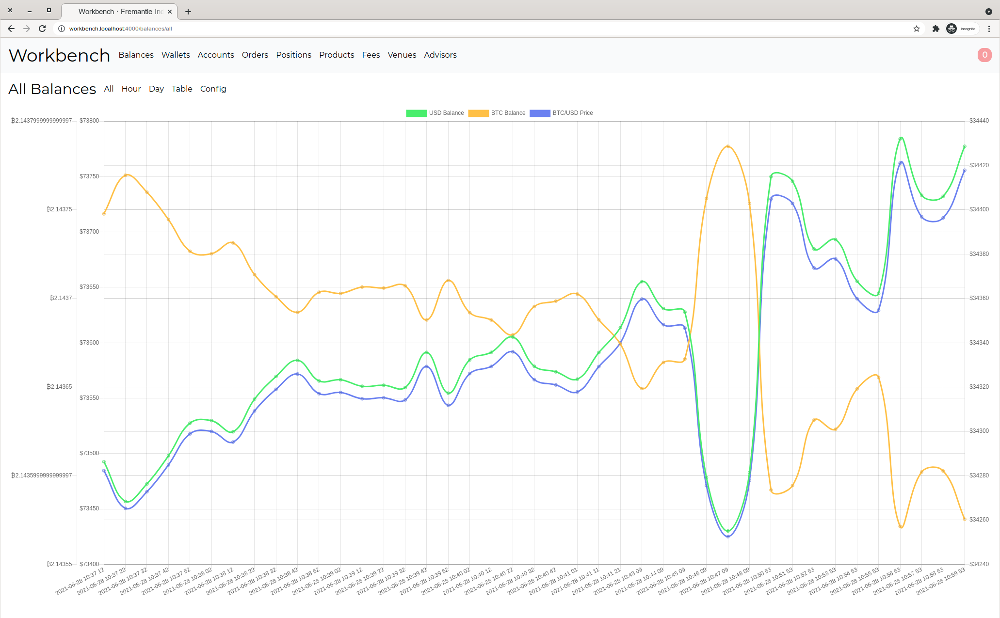
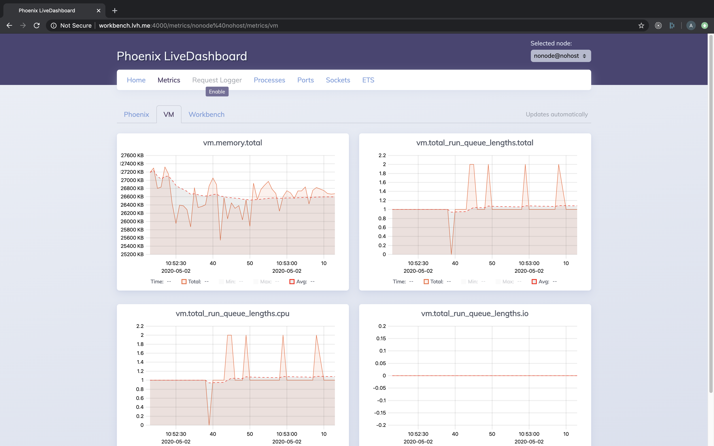
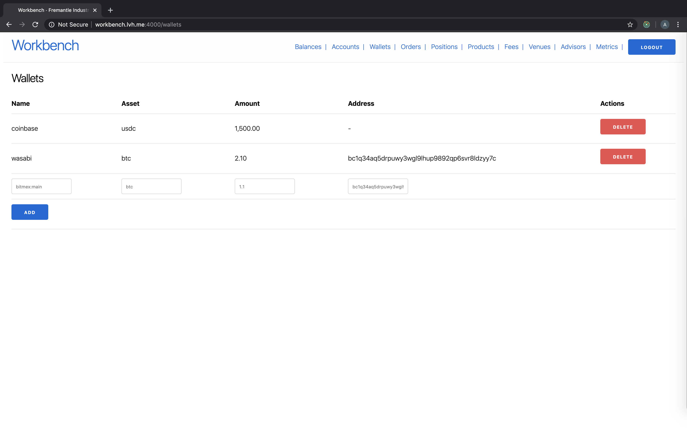
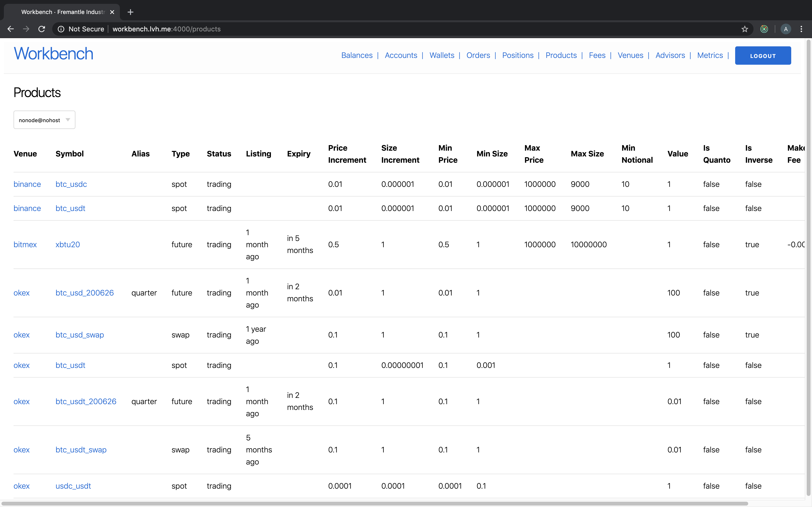
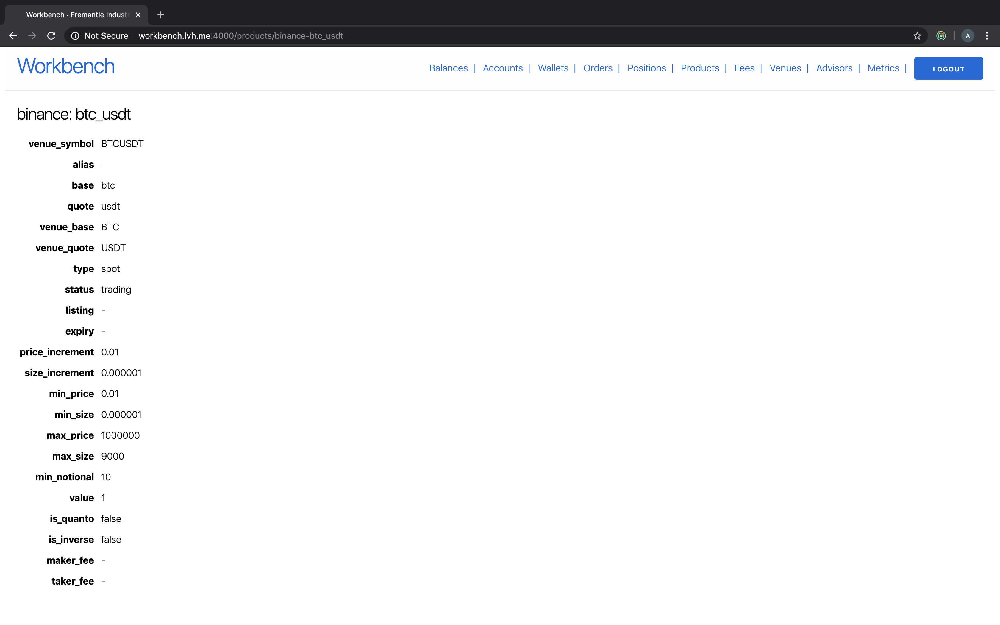

# Features

[Install](../README.md#install) | [Usage](../README.md#usage) | [Features](./FEATURES.md) | [Requirements](./REQUIREMENTS.md) | [Observability](./OBSERVABILITY.md)

### Notifications

### Remotely Control Trade Instances in a Cluster

### Live Portfolio Tracking & Historical Snapshots

### Watch System, Research & Trade Metrics Across Your Cluster

### Track Cold Storage

### Explore Products within the Trading Universe

## Planned Features

- [x] Notifications
- [ ] Trade Execution Reports
- [ ] Data Warehouse
- [ ] Backtester
