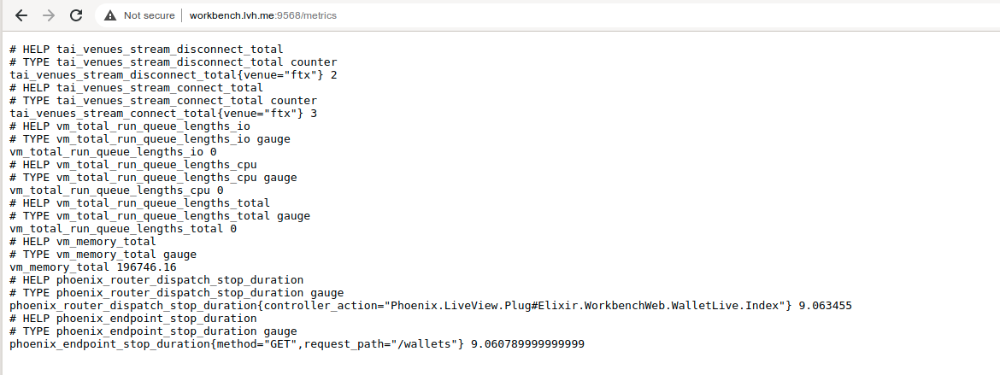
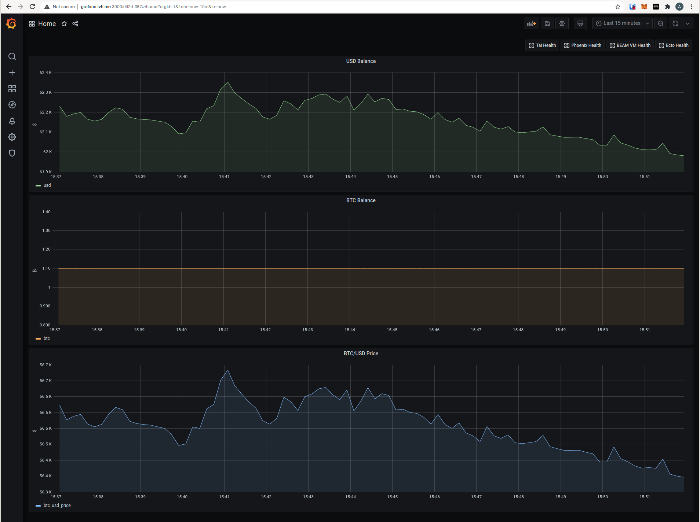

# Observability

[Install](../README.md#install) | [Usage](../README.md#usage) | [Features](./FEATURES.md) | [Requirements](./REQUIREMENTS.md) | [Configuration](./CONFIGURATION.md) | [Observability](./OBSERVABILITY.md)

## Exporting Metrics with Telemetry & Prometheus

`workbench` provides observability via the [`telemetry`](https://elixirschool.com/blog/instrumenting-phoenix-with-telemetry-part-one/)
library. The metrics are exported by default on the endpoint `:9568/metrics` for
prometheus to scrape.



The port to serve these metrics can be configured.

```elixir
# config/config.exs
prometheus_metrics_port =
  "PROMETHEUS_METRICS_PORT" |> System.get_env("9568") |> String.to_integer()
```

## Visualizing Operations With Grafana

This repository provides a [`docker-compose`](./docker-compose.yml) configuration
that runs `prometheus` & `grafana` so that you can visually keep track of your
trading operation.

| Service    | Endpoint                       |
| ---------- | :----------------------------: |
| Grafana    | http://grafana.localhost:3000/    |
| Prometheus | http://prometheus.localhost:9090/ |

It includes a grafana dashboard for balances and trade performance



Along with a dashboard to monitor the state of venues running in `tai`


